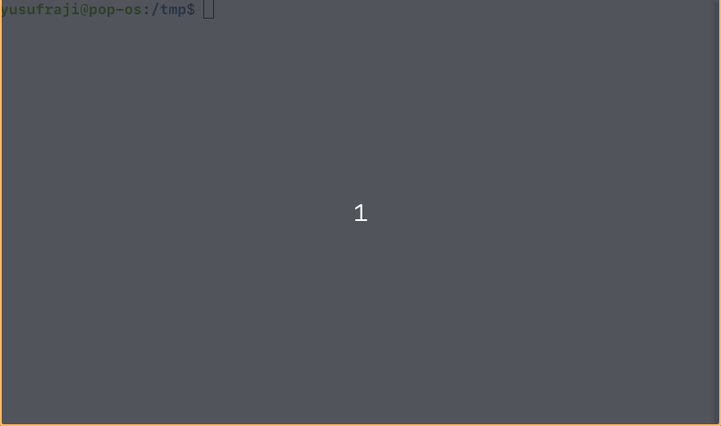

# guessing-game
A simple guessing game built in Rust

## Introduction

Hello fellow Rustacean.

This simple Rust project is built from the knowledge obtained from [Chapter 2](https://doc.rust-lang.org/book/ch02-00-guessing-game-tutorial.html) of
[The Book](https://doc.rust-lang.org/book/), and one of the projects on my
journey towards Rust mastery.


## How to use

Clone the repo, then run:

```rust
cargo run
```

The command above compiles the code and runs the resulting executable at all in
one command. The executable (`guessing_game`) can be found in `./target/debug/`. 

If you would like to obtain an optimized executable file that you can run anywhere,
regardless of whether you have Rust installed or not, run:

```rust
cargo build --release
./target/release/guessing_game
```

## Demo



> Note:  Rust is an *ahead-of-time* compiled language, meaning you can compile a
> program and run the executable somewhere else without having Rust installed.
> You need to have Rust installed to compile the program.